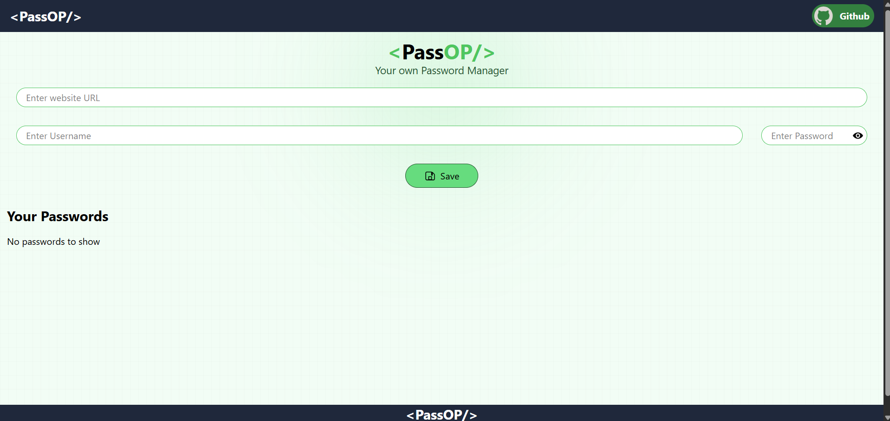

# 🔐 PassOp — Password Manager Web App (MERN Stack)


A **secure and modern password manager web application** built using the **MERN stack**, allowing users to store login credentials for multiple websites like **GitHub, LinkedIn**, and more in a clean and responsive interface.

---

## 📌 Table of Contents
- [Demo](#-demo)
- [Features](#-features)
- [Tech Stack](#-tech-stack)
- [How to Run](#-how-to-run-locally)
- [About Project](#-about-project)
- [About Me](#-about-me)
- [Connect with Me](#-connect-with-me)

---

## 🚀 Demo



🔗 **Live Demo:** _(Coming Soon)_

---

## ✨ Features
- 🔐 Store credentials for multiple websites  
- 🌐 Save website name (GitHub, LinkedIn, etc.)  
- 👤 Store username and password securely  
- ⚡ Fast and responsive UI  
- 🎨 Clean design using Tailwind CSS  
- 🔄 Full backend integration with Node.js  
- 💾 Data stored in MongoDB  
- 📱 Fully responsive on all devices  

---

## 🛠️ Tech Stack

- ⚛️ **React.js** — Frontend UI  
- 🎨 **Tailwind CSS** — Styling & responsiveness  
- 🟢 **Node.js** — Backend runtime  
- 🚀 **Express.js** — Backend framework  
- 🍃 **MongoDB** — Database  

---

## 🚦 How to Run Locally

```bash
# Clone the repository
git clone https://github.com/adarshj61/passop.git

# Move into the project folder
cd passop

# Install backend dependencies
cd backend
npm install
npm start

# Install frontend dependencies
cd ../frontend

npm install
npm run dev
```
---
## 📖 About Project

**PassOp** is a real-world full-stack project designed to understand how modern web applications handle **data storage**, **API communication**, and **UI rendering**.

The application allows users to:

- Enter a website name (e.g., GitHub, LinkedIn)
- Add their username and password
- Save credentials directly to the database

This project helped me practice building **end-to-end MERN applications**, managing **frontend–backend communication**, and structuring **scalable code**.

---

## 👨‍💻 About Me

I'm a **Computer Science Engineering student** with a strong interest in **full-stack web development**.  
I enjoy building real-world projects that solve practical problems and strengthen my development skills.

This project helped me improve my understanding of:

- MERN stack workflow
- REST APIs
- Database integration
- Clean UI design

---

## 🤝 Let's Connect!

I’m open to collaboration, internships, and exciting project ideas. Feel free to connect with me:

<p align="left" style="display: flex; gap: 10px; flex-wrap: wrap;">
  <a href="https://www.linkedin.com/in/adarsh-jaiswal-78a266353" target="_blank">
    
  </a>

  <a href="https://github.com/adarshj61" target="_blank">
    
  </a>

  <a href="mailto:aj941545@gmail.com">
    
  </a>

  <a href="#" target="_blank">
    
  </a>
</p>
